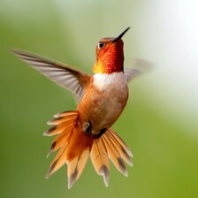
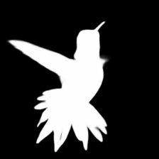
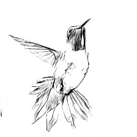

# convert-torch2trt-demo

## Startup docker container
```
bash make_env.sh
docker-compose up -d --build 
```

# Demo: Inference timm model
## show timm model list 
```bash
cd {repository root}/src
bash export_model_list_timm.sh
```
## inference demo resnet18
```bash
cd {repository root}/src
# convert torch to onnx
python torch2onnx_timm.py --model-name resnet18
# convert onnx to tensorrt
python onnx2trt.py --onnx-path "../onnx_model/resnet18.onnx"
# inference
python inference_timm.py general.image_path=../images/bird.jpg
```
# Demo: Inference demo U^2-Net
## download u2net onnx model
```bash
cd {repository root}/onnx_model/u2net
bash download.sh
```

## inference demo u2net (salient object detection)



```bash
cd {repository root}/src
# convert onnx to tensorrt
python onnx2trt.py --onnx-path ../onnx_model/u2net/u2net_salient_1_3_320_320.onnx
# inference
python inference_u2net.py u2net=salient general.image_path=../images/bird.jpg
# output image to ../images_out/{bird.jpg}
```

## inference demo u2net (portrait)



```bash
cd {repository root}/src
# convert onnx to tensorrt
python onnx2trt.py --onnx-path ../onnx_model/u2net/u2net_portrait_1_3_512_512.onnx
# inference
python inference_u2net.py u2net=portrait general.image_path=../images/bird.jpg
# output image to ../images_out/{bird.jpg}
```

# Command Option
## onnx2trt
```bash
python onnx2trt.py --onnx-path {your/onnx/path} {option: --fp16}
```
