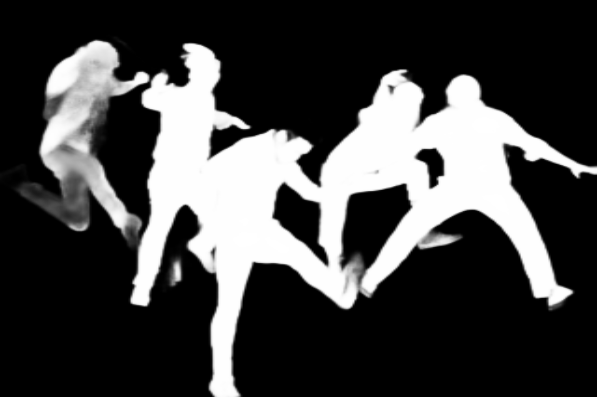
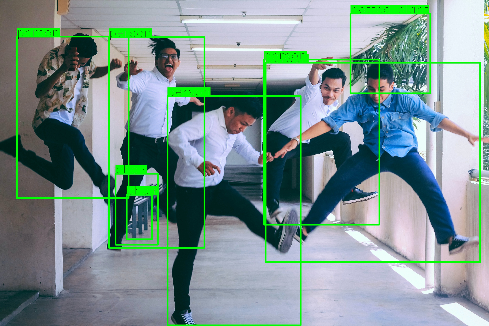

# convert-torch2trt-demo

## startup docker container
```
bash make_env.sh
docker-compose up -d --build 
```

# prepare build
```
cd {repository root}/src
bash build.sh
```

# Demo: Inference timm model
## show timm model list 
```bash
cd {repository root}/src
bash export_model_list_timm.sh
```
## inference demo resnet18
```bash
cd {repository root}/src
# convert torch to onnx
python torch2onnx_timm.py timm=resnet18
# convert onnx to tensorrt
python onnx2trt.py general.onnx_path=../onnx_model/resnet18.onnx
# inference
python inference_timm.py general.image_path=../images/bird.jpg
```

# Demo: Inference demo U^2-Net
## download u2net onnx model
```bash
cd {repository root}/onnx_model/u2net
bash download.sh
```

## inference demo u2net (salient object detection)


```bash
cd {repository root}/src
# convert torch to onnx in the official U^2-Net repository.
# convert onnx to tensorrt
python onnx2trt.py general.onnx_path=../onnx_model/u2net/u2net_salient_1_3_320_320.onnx
# inference
python inference_u2net.py u2net=salient general.image_path=../images/bird.jpg
# output image to ../images_out/{bird.jpg}
```

## inference demo u2net (portrait)


```bash
cd {repository root}/src
# convert torch to onnx in the official U^2-Net repository.
# convert onnx to tensorrt
python onnx2trt.py general.onnx_path=../onnx_model/u2net/u2net_portrait_1_3_512_512.onnx
# inference
python inference_u2net.py u2net=portrait general.image_path=../images/bird.jpg
# output image to ../images_out/{bird.jpg}
```

## inference demo u2net (human segmentation)


```bash
cd {repository root}/src
# convert torch to onnx in the official U^2-Net repository.
# convert onnx to tensorrt
python onnx2trt.py general.onnx_path=../onnx_model/u2net/u2net_human_seg_1_3_320_320.onnx
# inference
python inference_u2net.py u2net=human_seg general.image_path=../images/human.jpg
# output image to ../images_out/{human.jpg}
```


# Demo: Inference demo YOLOv3
## download yolo onnx model
```bash
cd {repository root}/onnx_model/yolo
bash download.sh
```
## inference demo YOLOv3 (coco object detection)


```bash
cd {repository root}/src
# convert torch to onnx in the mmdetection repository.
# convert onnx to tensorrt
python onnx2trt.py general.onnx_path=../onnx_model/yolo/yolov3_d53_mstrain-608_273e_coco.onnx rm_blow_nms=yolov3_d58
# inference
python inference_yolo.py general.image_path=../images/human.jpg
```

# Command Option
## onnx2trt (FP16)
```bash
python onnx2trt.py --onnx-path {your/onnx/path} general.fp16=True
```


# Reference
TensorRT: https://github.com/NVIDIA/TensorRT<br>
U^2-Net: https://github.com/xuebinqin/U-2-Net<br>
MMDetection: https://github.com/open-mmlab/mmdetection<br>
